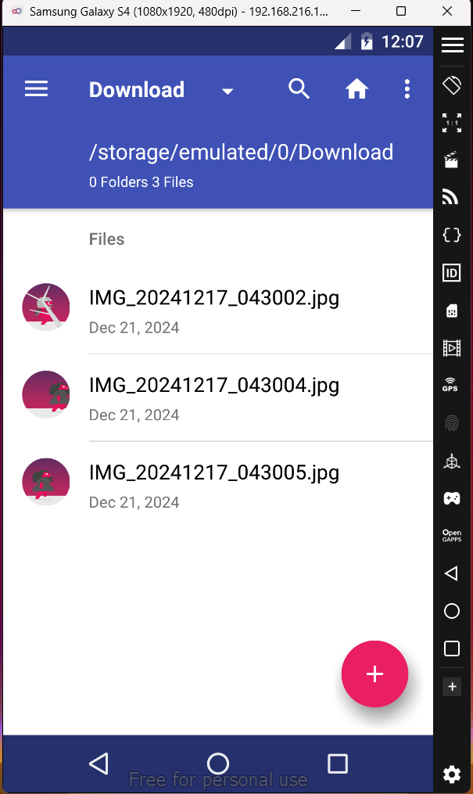
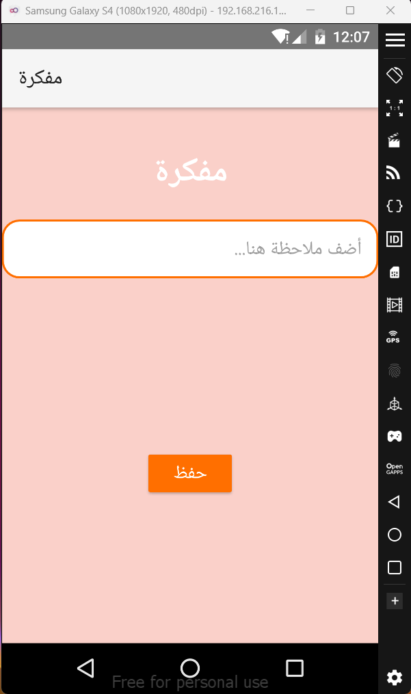
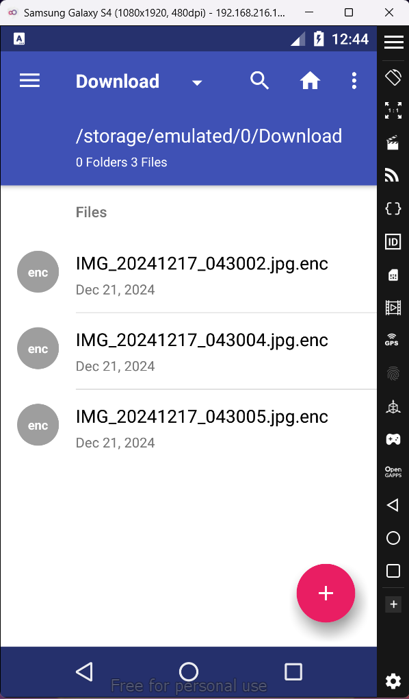

# MyRansomware App - README

## Overview
**MyRansomware** is an educational Android application designed to demonstrate file encryption and decryption techniques using RSA and AES algorithms. The app simulates a ransomware attack by encrypting files in the Downloads folder of a device, and it allows the user to decrypt those files using a decryption key entered through the app's interface.

### Disclaimer
The use of this application is strictly limited to academic purposes. The creator and developer of this application **are not responsible for any illegal activities** carried out using this app. This tool should only be used in controlled environments, such as security research or educational demonstrations, and should **never be used for malicious purposes**. Users should ensure that they have explicit permission to work with any files they encrypt or decrypt.

## App Workflow

### 1. **File Encryption**
Upon launching the app, it automatically checks the Downloads folder for files and begins the encryption process.

- **AES Encryption**: The app generates a random AES key to encrypt the contents of the files found in the Downloads folder.
- **RSA Encryption**: The AES key is then encrypted using a public RSA key.
- **File Deletion**: Once the files are encrypted, they are deleted from the Downloads folder to simulate the typical behavior of ransomware.

### 2. **User Interface**
The main screen of the app includes a text field for users to input their decryption key (if they have paid the ransom) and a "Save" button to save notes or any other information.

### 3. **Decryption Process**
The app allows the user to enter a decryption key in the note field:

- **RSA Decryption**: The app uses the private RSA key to decrypt the AES key.
- **AES Decryption**: The decrypted AES key is then used to decrypt the encrypted files.
- **Restoring Files**: After decryption, the app restores the files to the Downloads folder in their original format.

## Legal Disclaimer
By using this app, you agree to the following:
- The app is intended **only for academic or research purposes**. Any illegal activity involving the app is the sole responsibility of the user.
- The developer **does not support** or condone the use of this app for malicious purposes.
- All activities performed with this app should comply with local laws and regulations.

## Functions Explained

### 1. `onCreate()`
- Initializes the app, loads the public and private RSA keys, sets up listeners for buttons, and starts the encryption process as soon as the app is opened.
- **Note**: This function also handles the permission request for file access.

### 2. `checkPermissions()`
- Checks if the app has the necessary permissions to read and write to external storage.

### 3. `requestPermissions()`
- Requests the necessary permissions from the user if they are not granted.

### 4. `getPublicKey()` and `getPrivateKey()`
- These functions generate the RSA public and private keys used for encryption and decryption.

### 5. `encryptDownloadsFolder()`
- Encrypts all files in the Downloads folder using AES and then encrypts the AES key using RSA.
- Deletes the original files after encryption to simulate a ransomware attack.

### 6. `readFile()` 
- Reads the file from the specified URI and returns its contents as a byte array.

### 7. `generateAESKey()`
- Generates a random AES key for encrypting the file data.

### 8. `encryptDataWithAES()` and `decryptDataWithAES()`
- Encrypt and decrypt data using the AES key.

### 9. `encryptAESKeyWithRSA()` and `decryptAESKeyWithRSA()`
- Encrypts and decrypts the AES key using the RSA public and private keys respectively.

### 10. `saveToFile()`
- Saves the encrypted data or keys to a file in the Downloads folder.

### 11. `decryptDownloadsFolder()`
- Decrypts all encrypted files in the Downloads folder by reversing the encryption process (first decrypting the AES key, then decrypting the file data).

## How Encryption and Decryption Work

### Encryption:
1. The app generates a random AES key.
2. The AES key is used to encrypt the file's data.
3. The AES key is then encrypted using the public RSA key.
4. The encrypted data and encrypted AES key are saved in the Downloads folder.

### Decryption:
1. The app uses the private RSA key to decrypt the AES key.
2. The decrypted AES key is used to decrypt the encrypted file data.
3. The decrypted file is saved back to the Downloads folder.

## Screenshots

  
*The Downloads folder before encryption, containing 3 regular images.*

  
*The app interface, showing a note input field and a save button.*

  
*The Downloads folder after encryption, with files now encrypted.*

